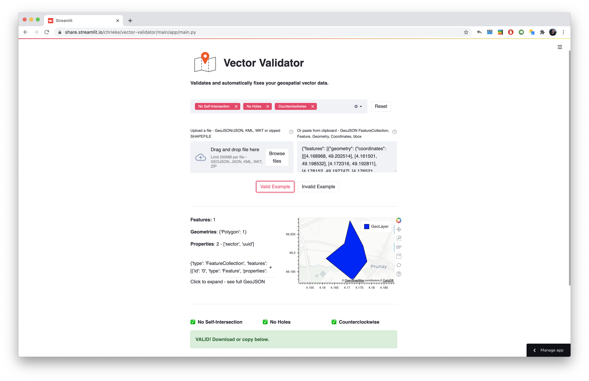

# vector-validator

Validates and automatically fixes your geospatial vector data. Build with [streamlit](https://streamlit.io/).

 

---

<h3 align="center">
    🔺 <a href="https://share.streamlit.io/chrieke/vector-validator/main/app/main">Use the vector-validator here!</a> 🔻
</h3>

---

    

## Functionality

**Validates and attempts to fix**:
- No Self-Intersection
- No Holes
- Counterclockwise winding

**Accepted data formats**:
- File Upload:
    - GeoJSON
    - JSON
    - KML
    - WKT
    - Shapefile (Zipfile containing shp,dbf,prj,shx files)
- Copy-paste:
    - GeoJSON FeatureCollection 
    - Feature
    - Geometry
    - Coordinates
    - bbox

